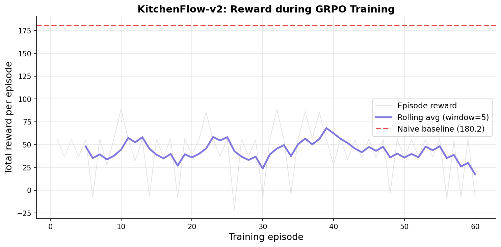
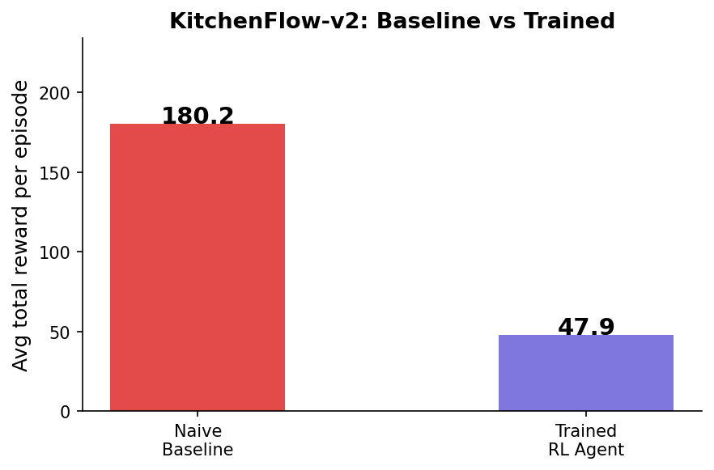

# KitchenFlow-v2 — Ghost Kitchen Dispatcher

🚀 **Training Notebook (Colab):** https://colab.research.google.com/drive/1Sfvju98sWX4HEDqJczHpGSiK1wSux2LW?usp=sharing
🔗 **Live Demo:** https://huggingface.co/spaces/manzz05/kitchenflow-v2  
📝 **Blog Post:** https://huggingface.co/spaces/manzz05/kitchenflow-v2/blob/main/blog.md

> *Everyone knows the pain of cold fries. KitchenFlow-v2 trains an AI to prevent it.*

## Training Results

### Reward Curve

### Before vs After

## The Problem
Ghost kitchens lose money every day to the order-ready mismatch. Summon a driver too early — they wait 20 minutes and may cancel (−20 penalty). Summon too late — food drops from 72°C to 55°C (−1 per degree). The agent must learn perfect timing under real-time uncertainty.

## What's New in v2
- **Multi-agent:** KitchenCoordinator sub-agent broadcasts prep signals
- **Chaos events:** Driver cancellations, traffic surges, GPS corruption
- **Expanded action space:** 4 actions including priority requests and GPS requery
- **5 tasks:** T1–T5 from easy single order to enterprise lunch rush
- **Richer rewards:** Sync bonus, rush completion, chaos recovery bonus

## Tasks
| Task ID | Difficulty | Orders | Chaos | Time Limit |
|---------|-----------|--------|-------|-----------|
| `T1_single_order_dispatch` | Easy | 1 | None | 30 min |
| `T2_multi_order_coordination` | Medium | 3 | None | 35 min |
| `T3_peak_hour_rush` | Hard | 5 | None | 45 min |
| `T4_chaos_dispatch` | Medium | 1 | 1 event | 30 min |
| `T5_enterprise_lunch_rush` | Hard | 5 | 2 events | 60 min |

## Action Space
| Code | Action | Description |
|------|--------|-------------|
| 0 | `wait` | Do nothing |
| 1 | `summon_driver` | Call nearest driver |
| 2 | `request_priority` | Ask coordinator to speed up prep |
| 3 | `requery_gps` | Use when GPS data is stale |

## Reward Function
| Signal | Value | Trigger |
|--------|-------|---------|
| `delivery_base` | +50 | Order delivered |
| `sync_bonus` | +10 | Driver arrives ≤ 2 min of food ready |
| `rush_bonus` | +15 | All orders done in ≤ 75% of max s
